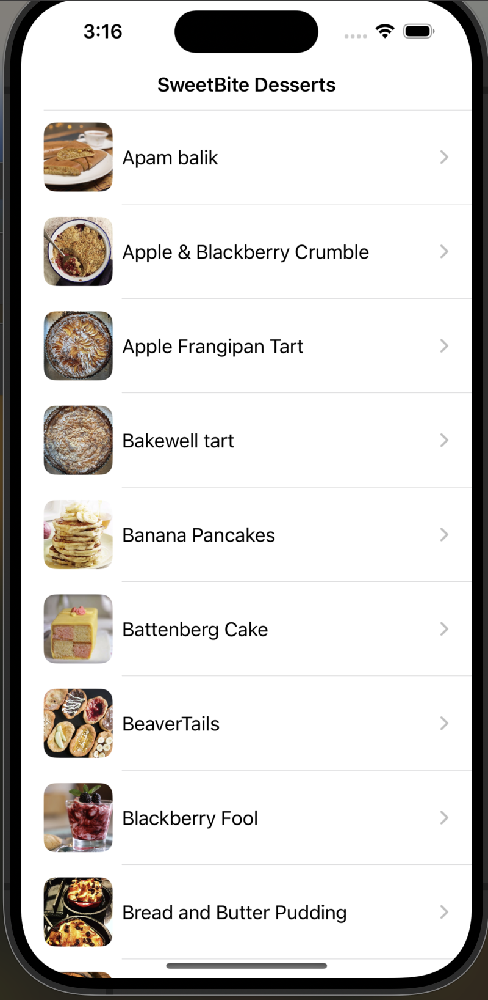
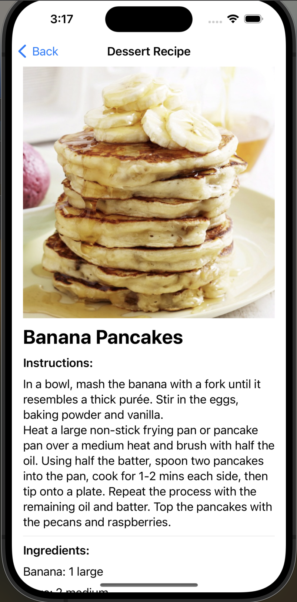
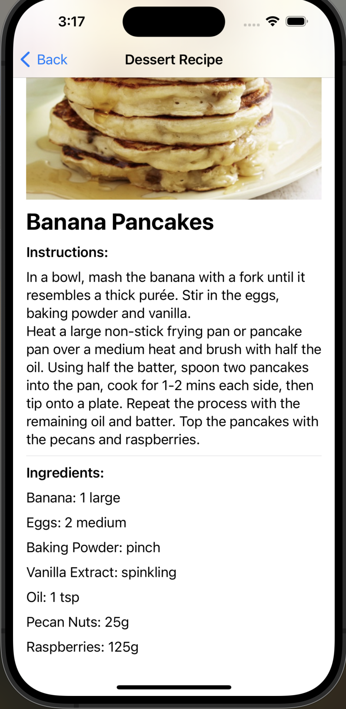
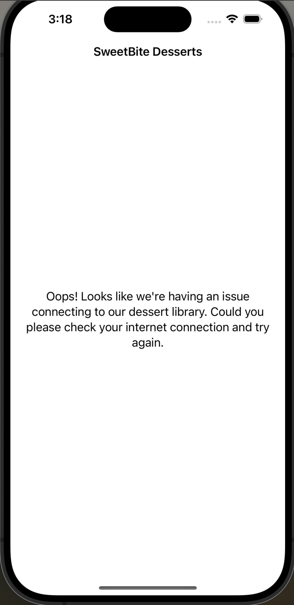

# SweetBite - Dessert Recipe iOS App

## Overview
SweetBite is a simple application built using Swift 5 and Xcode 15. It lets users browse through a curated list of dessert recipes, offering detailed insights into each dessert's ingredients, instructions, and more.

## Features

- **Dessert List:** A visually appealing list of desserts, sorted alphabetically for easy navigation.
- **Dessert Detail:** Detailed view of each dessert, including the recipe name, cooking instructions, and ingredients with measures.
- **Error Handling:** Graceful error handling on both the Dessert List and Detail views, ensuring a smooth user experience.

## Screens
1. **Dessert List Screen** 
     
     
2. **Dessert Detail Screen**
     
    
     
3. **Error Screen**
     
    

## API Integration
This app utilizes two main endpoints from [TheMealDB API](https://themealdb.com/api.php):

- [https://themealdb.com/api/json/v1/1/filter.php?c=Dessert](https://themealdb.com/api/json/v1/1/filter.php?c=Dessert) for fetching the list of desserts.
- [https://themealdb.com/api/json/v1/1/lookup.php?i=MEAL_ID](https://themealdb.com/api/json/v1/1/lookup.php?i=MEAL_ID) for fetching details of a specific dessert.

All data is filtered to exclude null or empty values for a cleaner user experience.

## Technical Details

- **UI Framework:** SwiftUI is used to design the user interface, providing a native and fluid experience on iOS devices.
- **API Calls:** URLSession is utilized for handling API requests, ensuring efficient and reliable data retrieval.

## Getting Started
To run SweetBite App on your local machine, you will need to have Xcode installed. Clone the repository, open the project in Xcode, and run it on your preferred simulator or physical device.

---

Developed with ❤️ by Roshni Soni
